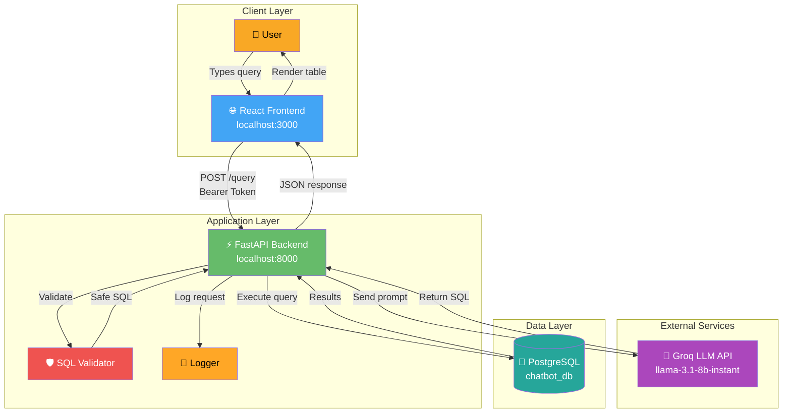
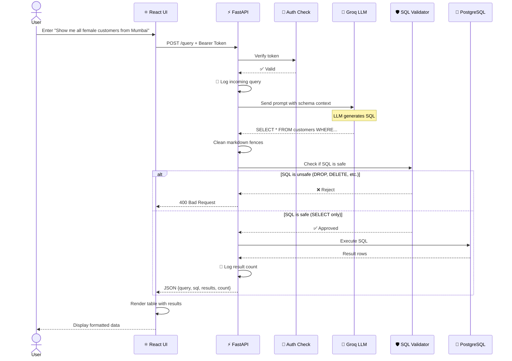
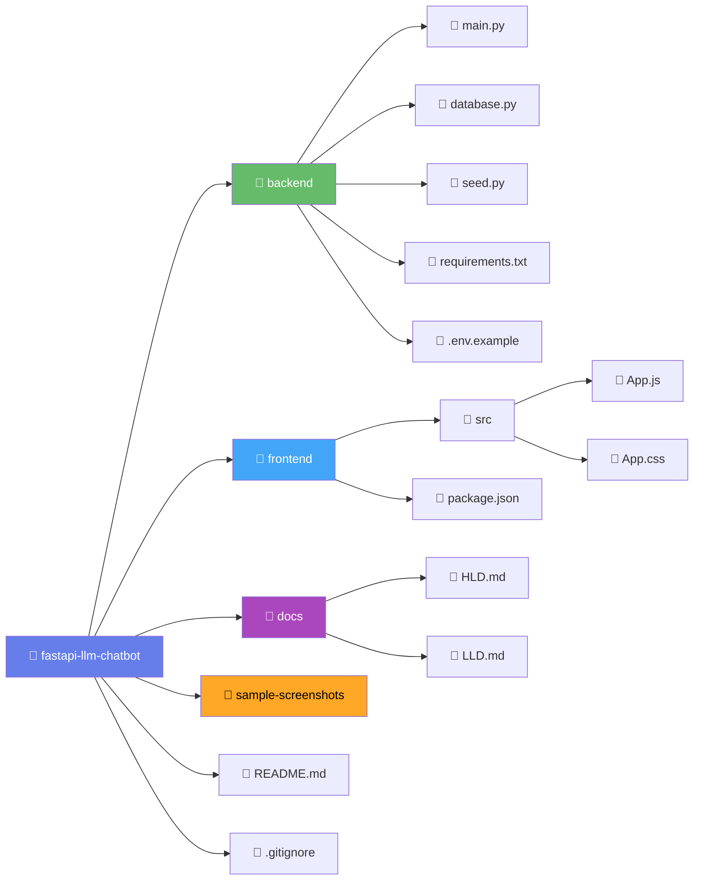
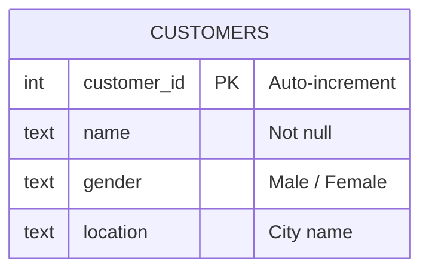
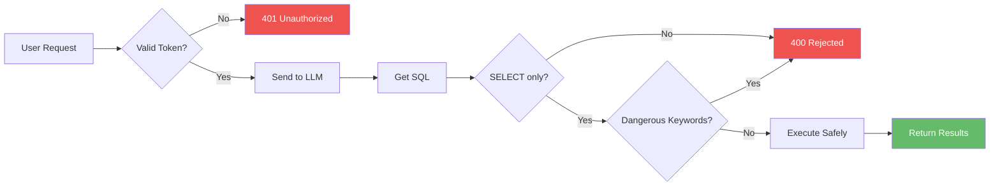

# 🤖 LLM-Powered Chatbot with FastAPI, PostgreSQL & Groq

> A full-stack intelligent chatbot that converts **natural language queries** into **SQL** using Groq's Llama 3.1 LLM, executes them against a PostgreSQL database, and displays formatted results in a modern React UI.

Built as part of the **Superteams.ai FastAPI + LLM Chatbot Challenge**.

---

## 📑 Table of Contents

- [Features](#-features)
- [Tech Stack](#%EF%B8%8F-tech-stack)
- [Architecture Overview](#-architecture-overview)
- [Request Flow](#-request-flow)
- [Project Structure](#-project-structure)
- [Database Schema](#%EF%B8%8F-database-schema)
- [Prerequisites](#-prerequisites)
- [Setup Instructions](#-setup-instructions)
- [API Documentation](#-api-documentation)
- [Example Queries](#-example-queries)
- [Screenshots](#-screenshots)
- [Security](#-security)
- [Documentation](#-documentation)
- [Author](#-author)

---

## ✨ Features

- 🧠 **Natural Language to SQL** — Powered by Groq's `llama-3.1-8b-instant` model
- ⚡ **FastAPI Backend** — Async, high-performance, auto-generated Swagger docs
- 🐘 **PostgreSQL Database** — Production-grade relational DB with SQLAlchemy ORM
- ⚛️ **React Frontend** — Clean, responsive UI with gradient design and live SQL preview
- 🔒 **Token Authentication** — Bearer token protection for API endpoints
- 🛡️ **SQL Injection Defense** — Only `SELECT` queries allowed; dangerous keywords blocked
- 📝 **Structured Logging** — Tracks incoming queries, generated SQL, and execution results
- ⚙️ **Environment Config** — `.env` based secret management
- 🎨 **Error Handling** — Graceful fallbacks for invalid queries and LLM errors

---

## 🏗️ Tech Stack

| Layer        | Technology                       |
| ------------ | -------------------------------- |
| **Backend**  | FastAPI (Python 3.12)            |
| **Frontend** | ReactJS 18 + Axios               |
| **Database** | PostgreSQL 16                    |
| **ORM**      | SQLAlchemy 2.0                   |
| **LLM**      | Groq Cloud (llama-3.1-8b-instant)|
| **Server**   | Uvicorn (ASGI)                   |
| **Styling**  | Vanilla CSS with gradients       |

---

## 🏛️ Architecture Overview



---

## 🔄 Request Flow



---

## 📁 Project Structure



```
fastapi-llm-chatbot/
├── backend/
│   ├── main.py              # FastAPI app + /query endpoint
│   ├── database.py          # SQLAlchemy setup + Customer model
│   ├── seed.py              # Sample data seeder
│   ├── requirements.txt     # Python dependencies
│   ├── .env.example         # Environment template
│   └── .env                 # (git-ignored)
├── frontend/
│   ├── src/
│   │   ├── App.js           # Main React component
│   │   └── App.css          # Styles
│   ├── public/
│   └── package.json
├── docs/
│   ├── HLD.md               # High-Level Design document
│   └── LLD.md               # Low-Level Design document
├── sample-screenshots/      # UI & testing screenshots
├── .gitignore
└── README.md
```

---

## 🗃️ Database Schema



**Seed Data (7 customers):**

| customer_id | name          | gender | location  |
| ----------- | ------------- | ------ | --------- |
| 1           | Aarav Sharma  | Male   | Mumbai    |
| 2           | Priya Patel   | Female | Mumbai    |
| 3           | Rohan Gupta   | Male   | Delhi     |
| 4           | Ananya Singh  | Female | Bangalore |
| 5           | Vikram Iyer   | Male   | Chennai   |
| 6           | Sneha Reddy   | Female | Hyderabad |
| 7           | Kavya Nair    | Female | Mumbai    |

---

## 📋 Prerequisites

- Python **3.9+**
- Node.js **18+**
- PostgreSQL **14+**
- A **Groq API key** (free tier): https://console.groq.com

---

## 🚀 Setup Instructions

### 1️⃣ Clone the Repository

```bash
git clone https://github.com/Mainak18/fastapi-llm-chatbot.git
cd fastapi-llm-chatbot
```

### 2️⃣ Set Up PostgreSQL

```bash
sudo apt install postgresql postgresql-contrib -y
sudo systemctl start postgresql
sudo -u postgres psql
```

Inside `psql`, run these **one at a time**:

```sql
CREATE DATABASE chatbot_db;
CREATE USER chatbot_user WITH PASSWORD 'chatbot123';
GRANT ALL PRIVILEGES ON DATABASE chatbot_db TO chatbot_user;
\c chatbot_db
GRANT ALL ON SCHEMA public TO chatbot_user;
ALTER DATABASE chatbot_db OWNER TO chatbot_user;
\q
```

### 3️⃣ Backend Setup

```bash
cd backend
python3 -m venv venv
source venv/bin/activate
pip install -r requirements.txt
```

Create `.env` from the template:

```bash
cp .env.example .env
nano .env  # Add your Groq API key
```

Seed the database:

```bash
python seed.py
```

Start the backend server:

```bash
uvicorn main:app --reload
```

✅ Backend is now running at **http://localhost:8000**
📖 Interactive API docs at **http://localhost:8000/docs**

### 4️⃣ Frontend Setup

Open a **new terminal**:

```bash
cd frontend
npm install
npm start
```

✅ Frontend is now running at **http://localhost:3000**

---

## 📡 API Documentation

### `GET /`
Health check endpoint.

**Response:**
```json
{ "message": "LLM Chatbot API is running!" }
```

### `POST /query`
Convert natural language to SQL and execute it.

**Headers:**
```
Content-Type: application/json
Authorization: Bearer mysecrettoken123
```

**Request Body:**
```json
{ "query": "Show me all female customers from Mumbai" }
```

**Success Response (200):**
```json
{
  "user_query": "Show me all female customers from Mumbai",
  "generated_sql": "SELECT * FROM customers WHERE gender ILIKE 'female' AND location ILIKE 'mumbai'",
  "results": [
    { "customer_id": 2, "name": "Priya Patel", "gender": "Female", "location": "Mumbai" },
    { "customer_id": 7, "name": "Kavya Nair", "gender": "Female", "location": "Mumbai" }
  ],
  "count": 2
}
```

**Error Responses:**

| Status | Reason                                    |
| ------ | ----------------------------------------- |
| 401    | Missing or invalid Bearer token           |
| 400    | Unsafe SQL rejected (non-SELECT query)    |
| 500    | Internal error (LLM failure, DB error)    |

### cURL Example

```bash
curl -X POST http://localhost:8000/query \
  -H "Content-Type: application/json" \
  -H "Authorization: Bearer mysecrettoken123" \
  -d '{"query": "Show me all female customers from Mumbai"}'
```

---

## 💬 Example Queries

Try these in the UI or via cURL:

- 💁‍♀️ "Show me all female customers from Mumbai"
- 👨 "List all male customers"
- 📊 "How many customers are from Bangalore?"
- 🌍 "Show all customers"
- 🔍 "Find customers whose name starts with A"
- 📍 "Which cities have customers?"

---

## 📸 Screenshots

Check the [`sample-screenshots/`](./sample-screenshots) folder for visual examples:

| File                                    | Description                         |
| --------------------------------------- | ----------------------------------- |
| `chatbot_sample1.png`                   | Main UI with query result           |
| `chatbot_sample2.png`                   | Different query example             |
| `chatbot_sample3.png`                   | Another query demo                  |
| `curl_test_backend_endpoints.png`       | Backend tested via cURL             |
| `linux_ubuntu_terminal_backend.png`     | Backend server logs                 |
| `linux_ubuntu_terminal_frontend.png`    | Frontend dev server running         |

---

## 🔒 Security



**Protection layers:**

1. **🔐 Bearer Token Auth** — All `/query` requests require `Authorization: Bearer <token>`
2. **🛡️ SQL Whitelisting** — Only `SELECT` statements are permitted
3. **🚫 Keyword Blacklist** — Blocks `DROP`, `DELETE`, `UPDATE`, `INSERT`, `ALTER`, `TRUNCATE`, `CREATE`, `;--`
4. **🧹 LLM Output Sanitization** — Strips markdown fences before execution
5. **🔑 Secret Management** — API keys in `.env` file, never committed to git
6. **📊 Structured Logging** — All queries logged for audit trail

---

## 📚 Documentation

Detailed architectural documentation is available in the `docs/` folder:

- 📘 **[High-Level Design (HLD)](./docs/HLD.md)** — System architecture, components, design decisions
- 📙 **[Low-Level Design (LLD)](./docs/LLD.md)** — Class diagrams, function signatures, data flow details

---

## 🎯 Requirements Checklist

✅ FastAPI backend  
✅ ReactJS frontend  
✅ PostgreSQL database (chose this over SQLite for production quality)  
✅ Groq LLM (llama-3.1-8b-instant)  
✅ Customers table with `customer_id`, `name`, `gender`, `location`  
✅ Seeded with 7 sample entries  
✅ Natural language → SQL generation  
✅ Formatted result display  
✅ **Bonus:** Logging for queries & SQL  
✅ **Bonus:** Error handling (401, 400, 500)  
✅ **Bonus:** `.env` for secrets  
✅ **Bonus:** Token-based API authentication  
✅ **Bonus:** HLD & LLD documentation with Mermaid diagrams  

---

## 👤 Author

**Mainak Bhattacharjee**  
Built for the **Superteams.ai FastAPI + LLM Chatbot Challenge** (April 2026)  
GitHub: [@Mainak18](https://github.com/Mainak18)

---

## 📄 License

This project is built as an assignment submission and is free to use for learning purposes.
