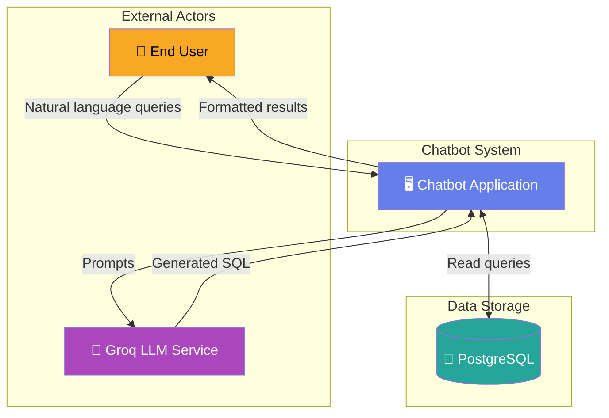
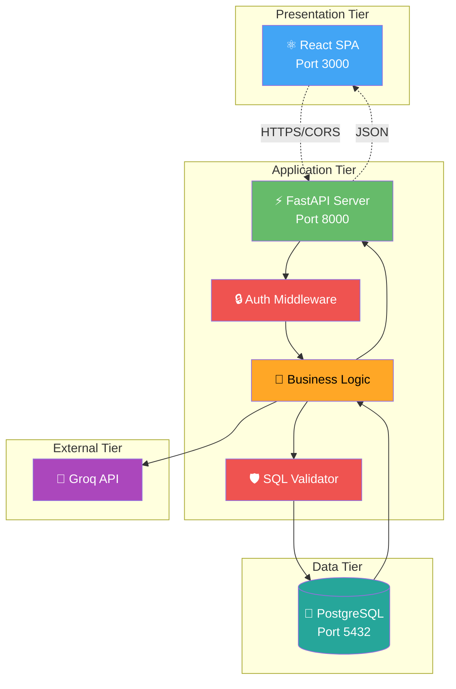
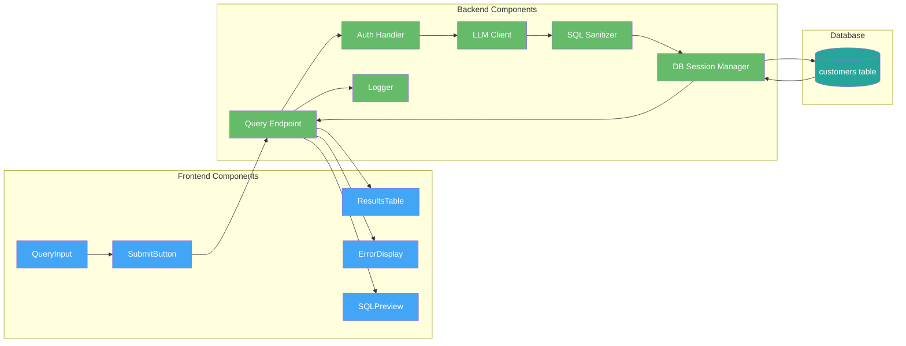
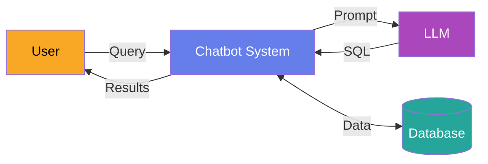
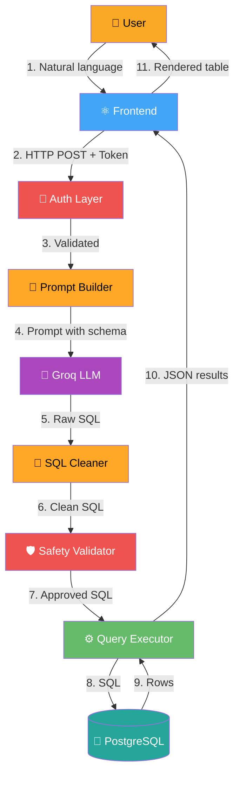
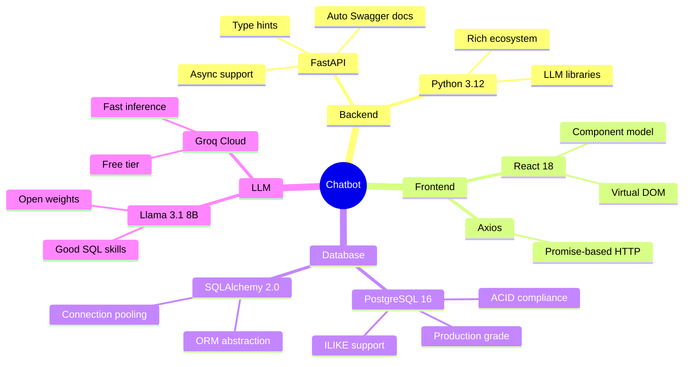
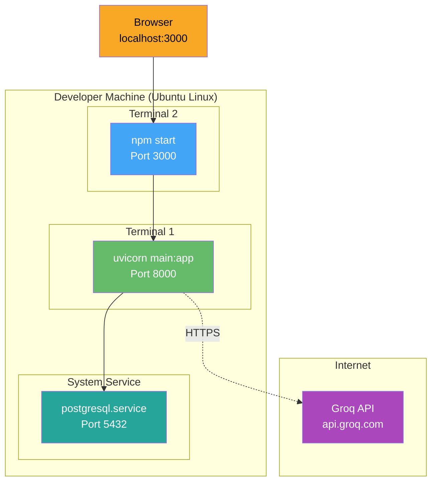
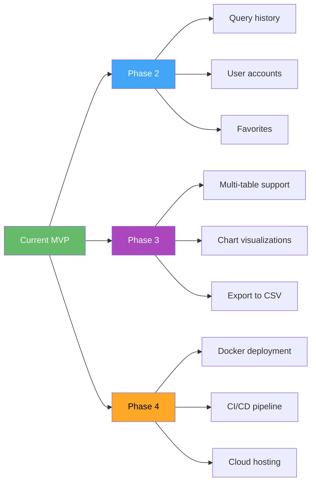

# 📘 High-Level Design (HLD)
## LLM-Powered Chatbot with FastAPI & PostgreSQL

**Project:** FastAPI + LLM Chatbot Challenge  
**Author:** Mainak Bhattacharjee
**Version:** 1.0  
**Date:** April 2026

---

## 1. Introduction

### 1.1 Purpose
This document describes the high-level architecture of an intelligent chatbot system that converts natural language queries into SQL and retrieves data from a relational database. The system uses a Large Language Model (LLM) hosted by Groq to interpret user intent.

### 1.2 Scope
The system allows non-technical users to query a customer database using plain English instead of writing SQL. It returns structured, tabular results through a web interface.

### 1.3 Target Audience
- Developers maintaining the system
- Reviewers evaluating the project
- Stakeholders understanding the design

---

## 2. System Overview

### 2.1 Context Diagram

### 2.2 Key Objectives
1. **Accessibility** — Enable non-technical users to query data without SQL knowledge
2. **Accuracy** — Generate correct SQL from varied natural language phrasings
3. **Security** — Prevent SQL injection and unauthorized access
4. **Performance** — Respond within 2-3 seconds per query
5. **Maintainability** — Modular, well-documented codebase

---

## 3. Architectural Design

### 3.1 Three-Tier Architecture

### 3.2 Layer Responsibilities

| Layer            | Responsibility                                                |
| ---------------- | ------------------------------------------------------------- |
| **Presentation** | UI rendering, user input capture, result display              |
| **Application**  | Request routing, authentication, LLM interaction, validation  |
| **Data**         | Persistent storage of customer records, query execution       |
| **External**     | Natural language to SQL conversion (Groq)                     |

---

## 4. Component Diagram

---

## 5. Data Flow Diagram

### 5.1 Level 0 (Context)

### 5.2 Level 1 (Detailed)

---

## 6. Technology Stack

### 6.1 Stack Choices & Rationale

### 6.2 Why These Choices?

| Choice          | Why                                                             |
| --------------- | --------------------------------------------------------------- |
| **FastAPI**     | Modern, async, automatic Swagger/OpenAPI docs                   |
| **PostgreSQL**  | Production-grade; chose over SQLite for real-world quality      |
| **React**       | Most popular frontend library, component-based architecture     |
| **Groq**        | Free tier, extremely fast inference (~300 tokens/sec)           |
| **Llama 3.1**   | Strong at code/SQL generation, open weights, reliable           |
| **SQLAlchemy**  | Industry-standard Python ORM, type-safe queries                 |

---

## 7. Key Design Decisions

### 7.1 Why Natural Language → SQL (not direct query)?
- Allows non-technical users to access data
- Reduces need for custom API endpoints per query type
- Flexible: new queries don't require code changes

### 7.2 Why SELECT-only?
- Prevents destructive operations by malicious users
- LLMs can hallucinate or be tricked into generating harmful SQL
- Read-only guarantees data integrity

### 7.3 Why Bearer Token (not OAuth)?
- Simpler for an assignment/demo
- Meets "optional token-based check" requirement
- OAuth would be overkill for this scope

### 7.4 Why PostgreSQL over SQLite?
- Demonstrates production readiness
- Case-insensitive `ILIKE` operator (SQLite lacks this natively)
- Better concurrency for future scaling

---

## 8. Non-Functional Requirements

| Category            | Requirement                                           |
| ------------------- | ----------------------------------------------------- |
| **Performance**     | Response < 3 seconds per query                        |
| **Availability**    | 99% uptime (dev target)                               |
| **Security**        | Token auth + SQL injection prevention                 |
| **Usability**       | Clean UI, example queries shown to user               |
| **Maintainability** | Modular code, documented, .env config                 |
| **Scalability**     | Stateless backend (can be horizontally scaled)        |
| **Observability**   | Structured logging of all queries                     |

---

## 9. Deployment Topology (Current - Local Dev)

---

## 10. Future Enhancements

---

## 11. Risks & Mitigations

| Risk                               | Impact | Mitigation                          |
| ---------------------------------- | ------ | ----------------------------------- |
| LLM generates invalid SQL          | Medium | SQL validator rejects bad queries   |
| LLM generates harmful SQL          | High   | Whitelist SELECT only               |
| Groq API rate limit hit            | Low    | Free tier is generous for demo      |
| API key leaked                     | High   | `.env` git-ignored, rotatable       |
| Database downtime                  | Medium | Try/except around DB calls          |
| User types nonsense query          | Low    | Returns empty results gracefully    |

---

## 12. Conclusion

This HLD outlines a clean, secure, three-tier architecture leveraging modern tools (FastAPI, React, PostgreSQL) and cutting-edge LLM technology (Groq's Llama 3.1). The design prioritizes security, usability, and maintainability while meeting all functional requirements of the challenge.

For implementation details, see the [Low-Level Design document](./LLD.md).
