# 📙 Low-Level Design (LLD)
## LLM-Powered Chatbot with FastAPI & PostgreSQL

**Project:** FastAPI + LLM Chatbot Challenge  
**Author:** Mainak Bhattacharjee  
**Version:** 1.0  
**Date:** April 2026

---

## 1. Introduction

This document provides implementation-level details of the chatbot system. It covers class structures, function signatures, database models, API contracts, and step-by-step execution flows. Read the [HLD](./HLD.md) first for the big picture.

---

## 2. Module Structure

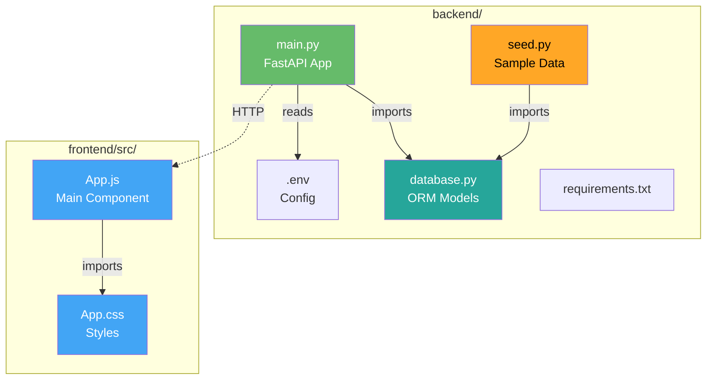

---

## 3. Database Layer (`database.py`)

### 3.1 Class Diagram

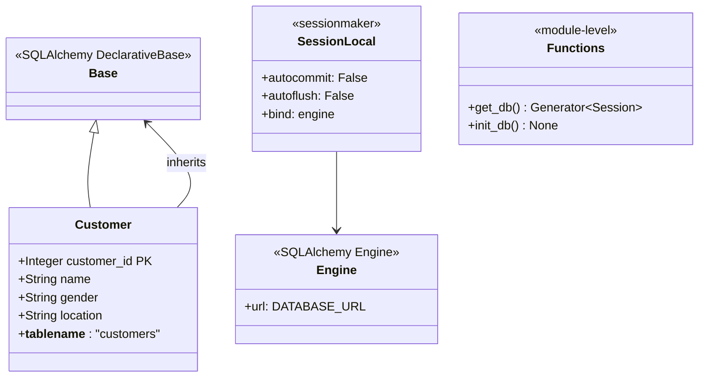

### 3.2 Responsibilities

| Component       | Responsibility                                         |
| --------------- | ------------------------------------------------------ |
| `Base`          | SQLAlchemy declarative base class                      |
| `Customer`      | ORM model for `customers` table                        |
| `engine`        | Database connection pool                               |
| `SessionLocal`  | Session factory                                        |
| `get_db()`      | FastAPI dependency for per-request DB sessions         |
| `init_db()`     | Creates tables if they don't exist                     |

### 3.3 Key Code

```python
class Customer(Base):
    __tablename__ = "customers"
    customer_id = Column(Integer, primary_key=True, index=True)
    name = Column(String, nullable=False)
    gender = Column(String, nullable=False)
    location = Column(String, nullable=False)

def get_db():
    db = SessionLocal()
    try:
        yield db
    finally:
        db.close()
```

---

## 4. API Layer (`main.py`)

### 4.1 Component Interaction

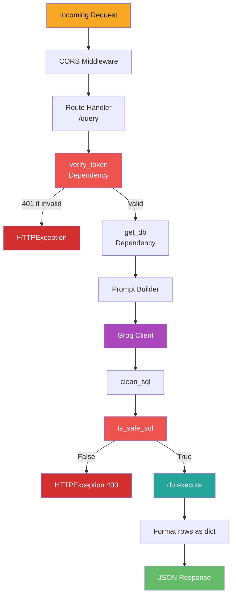

### 4.2 Function Specifications

#### `verify_token(authorization: str) -> bool`

| Attribute    | Value                                               |
| ------------ | --------------------------------------------------- |
| **Purpose**  | Check Bearer token in Authorization header          |
| **Input**    | `authorization: str` (from `Header(None)`)          |
| **Output**   | `True` if valid                                     |
| **Raises**   | `HTTPException(401)` if missing or invalid          |

#### `is_safe_sql(sql: str) -> bool`

| Attribute    | Value                                               |
| ------------ | --------------------------------------------------- |
| **Purpose**  | Whitelist SELECT, block dangerous operations        |
| **Input**    | `sql: str`                                          |
| **Output**   | `True` if safe, `False` otherwise                   |
| **Checks**   | Starts with `select`, no forbidden keywords         |

**Forbidden keywords list:**
```python
["drop", "delete", "update", "insert",
 "alter", "truncate", "create", ";--"]
```

#### `clean_sql(sql: str) -> str`

| Attribute    | Value                                               |
| ------------ | --------------------------------------------------- |
| **Purpose**  | Strip markdown code fences from LLM output          |
| **Input**    | `sql: str` (possibly with ```` ```sql ``` ```` tags)|
| **Output**   | Clean SQL string                                    |
| **Method**   | Regex substitution + trim whitespace/semicolons     |

#### `process_query(request, db, _) -> dict`

| Attribute    | Value                                               |
| ------------ | --------------------------------------------------- |
| **Route**    | `POST /query`                                       |
| **Input**    | `QueryRequest{query: str}`                          |
| **Output**   | `{user_query, generated_sql, results, count}`      |
| **Depends**  | `get_db`, `verify_token`                            |
| **Raises**   | 400 (bad SQL), 401 (auth), 500 (internal)           |

---

## 5. Prompt Engineering

### 5.1 Prompt Template

```
You are a SQL query generator. Convert the user's natural language 
question into a PostgreSQL SELECT query.

Table schema:
customers (customer_id INTEGER PRIMARY KEY, name TEXT, gender TEXT, location TEXT)

Rules:
- Return ONLY the SQL query, no explanation, no markdown.
- Only SELECT queries are allowed.
- Use case-insensitive matching with ILIKE for text comparisons.

User question: {user_query}

SQL query:
```

### 5.2 Why This Prompt Works

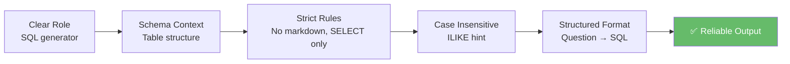

### 5.3 LLM Parameters

| Parameter     | Value                        | Why                                  |
| ------------- | ---------------------------- | ------------------------------------ |
| `model`       | `llama-3.1-8b-instant`       | Fast, capable, free tier             |
| `temperature` | `0.1`                        | Low = deterministic SQL output       |
| `messages`    | Single user message          | No chat history needed               |

---

## 6. End-to-End Execution Trace

### 6.1 Happy Path

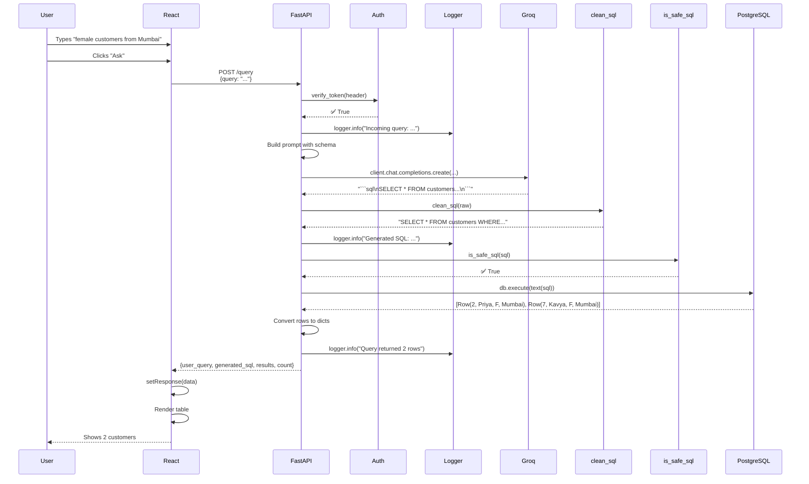

### 6.2 Error Path: Unsafe SQL

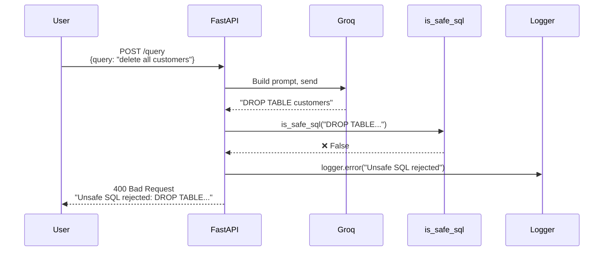

---

## 7. Frontend Component (`App.js`)

### 7.1 State Diagram

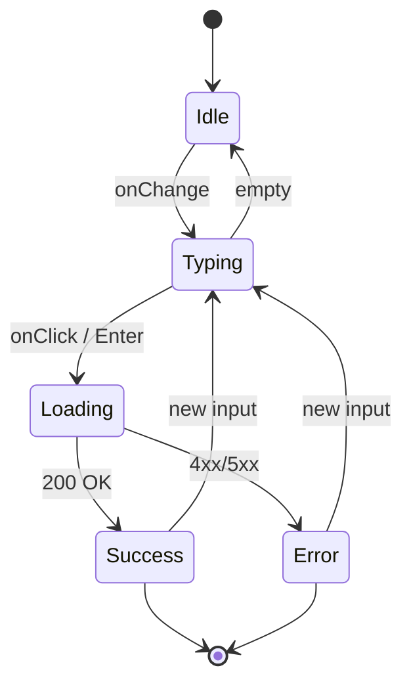

### 7.2 React State Variables

| State       | Type         | Purpose                            |
| ----------- | ------------ | ---------------------------------- |
| `query`     | `string`     | User's input text                  |
| `response`  | `object`     | API response (results + SQL)       |
| `loading`   | `boolean`    | Disables button during request     |
| `error`     | `string`     | Error message to display           |

### 7.3 Component Tree

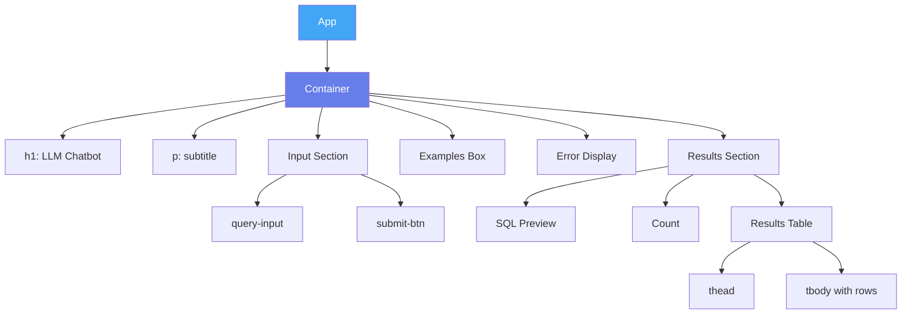

### 7.4 Key Functions

#### `handleSubmit()`
```javascript
const handleSubmit = async () => {
  if (!query.trim()) { setError('Please enter a query'); return; }
  setLoading(true); setError(''); setResponse(null);
  try {
    const res = await axios.post(API_URL,
      { query: query },
      { headers: { 'Content-Type': 'application/json',
                   'Authorization': `Bearer ${API_TOKEN}` }}
    );
    setResponse(res.data);
  } catch (err) {
    setError(err.response?.data?.detail || 'Something went wrong');
  } finally {
    setLoading(false);
  }
};
```

#### `handleKeyPress(e)`
Enables pressing `Enter` to submit — improves UX.

---

## 8. API Contract

### 8.1 OpenAPI Schema (simplified)

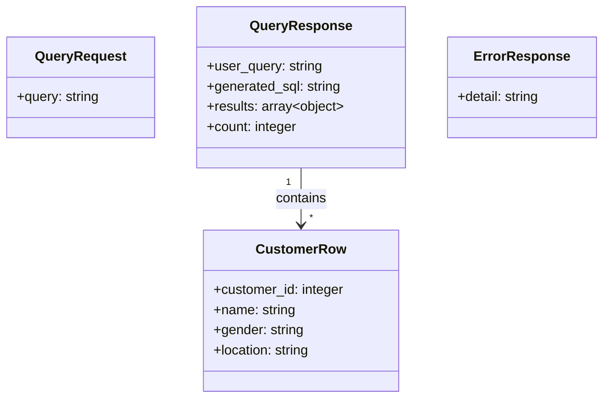

### 8.2 Status Code Contract

| Code | Meaning                  | When                                    |
| ---- | ------------------------ | --------------------------------------- |
| 200  | Success                  | Valid query, SQL executed               |
| 400  | Bad Request              | LLM generated unsafe SQL                |
| 401  | Unauthorized             | Missing or wrong Bearer token           |
| 422  | Validation Error         | Request body missing `query` field      |
| 500  | Internal Server Error    | LLM failure, DB error, unexpected crash |

---

## 9. Security Implementation

### 9.1 Defense in Depth

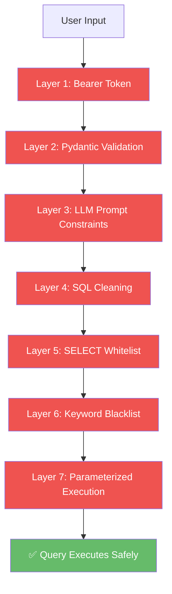

### 9.2 Secret Management Flow

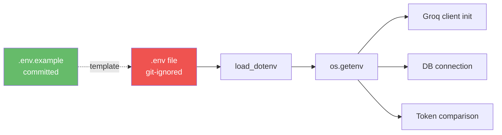

---

## 10. Logging Strategy

### 10.1 Log Points

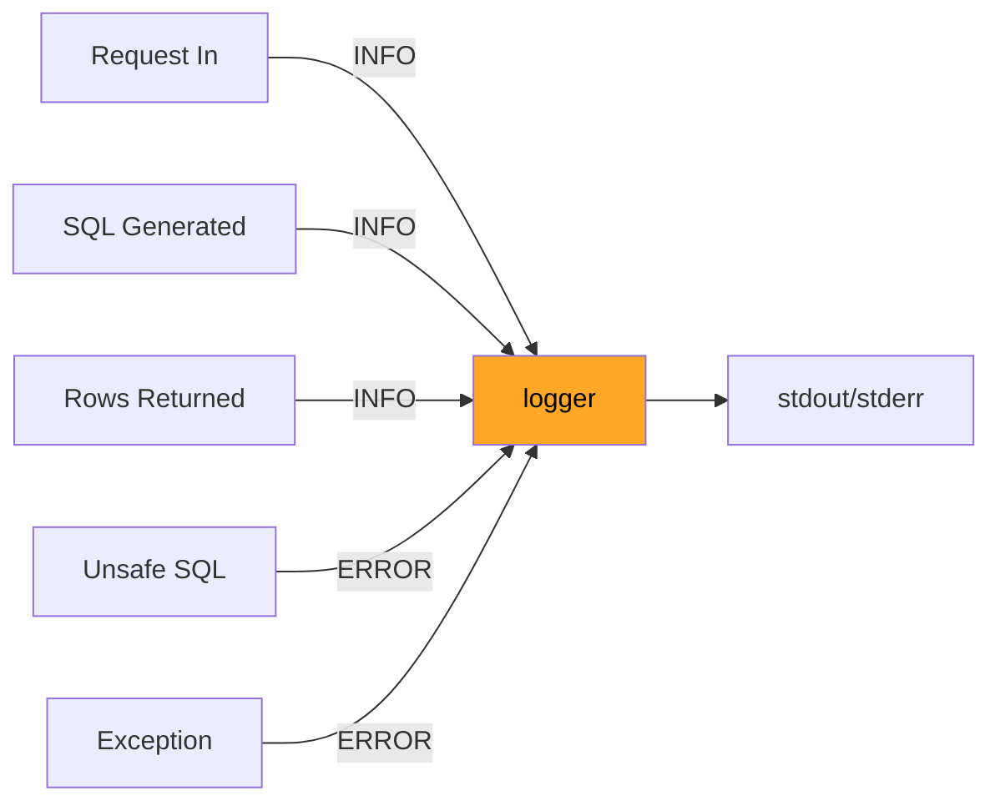

### 10.2 Log Format
```
2026-04-10 11:08:15,194 - INFO - Incoming query: Show me all female customers from Mumbai
2026-04-10 11:08:15,579 - INFO - Generated SQL: SELECT * FROM customers WHERE...
2026-04-10 11:08:15,581 - INFO - Query returned 2 rows
```

---

## 11. Testing Strategy

### 11.1 Manual Test Cases

| # | Test                    | Input                              | Expected                    |
| - | ----------------------- | ---------------------------------- | --------------------------- |
| 1 | Happy path              | "Show all customers"               | Returns all 7 rows          |
| 2 | Filter by gender        | "List female customers"            | Returns 4 female rows       |
| 3 | Filter by location      | "Customers from Mumbai"            | Returns 3 Mumbai customers  |
| 4 | Combined filter         | "Male customers in Delhi"          | Returns Rohan Gupta         |
| 5 | Count query             | "How many customers in Bangalore"  | Returns count result        |
| 6 | No token                | Missing Authorization header       | 401 Unauthorized            |
| 7 | Wrong token             | `Bearer wrong`                     | 401 Unauthorized            |
| 8 | Empty query             | `{"query": ""}`                    | Error message in UI         |
| 9 | Malicious query         | "Delete all customers"             | 400 Unsafe SQL rejected     |

### 11.2 cURL Test Commands

```bash
# Test 1: Happy path
curl -X POST http://localhost:8000/query \
  -H "Content-Type: application/json" \
  -H "Authorization: Bearer mysecrettoken123" \
  -d '{"query": "Show all customers"}'

# Test 6: No token
curl -X POST http://localhost:8000/query \
  -H "Content-Type: application/json" \
  -d '{"query": "Show all customers"}'
# Expected: 401
```

---

## 12. Deployment Steps

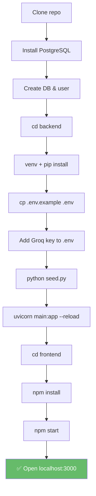

---

## 13. Dependencies

### 13.1 Backend (`requirements.txt`)
| Package          | Version  | Purpose                        |
| ---------------- | -------- | ------------------------------ |
| fastapi          | ≥0.135   | Web framework                  |
| uvicorn          | ≥0.44    | ASGI server                    |
| sqlalchemy       | ≥2.0     | ORM                            |
| psycopg2-binary  | ≥2.9     | PostgreSQL driver              |
| groq             | ≥1.1     | Groq LLM client                |
| python-dotenv    | ≥1.2     | Load .env files                |
| pydantic         | ≥2.12    | Request validation             |

### 13.2 Frontend (`package.json`)
| Package | Purpose                   |
| ------- | ------------------------- |
| react   | UI library                |
| axios   | HTTP client               |

---

## 14. Conclusion

This LLD has walked through every class, function, API contract, and data flow in the system. Combined with the [HLD](./HLD.md), any developer should be able to understand, maintain, and extend this chatbot with confidence.

**Key takeaways:**
- **Simple layered architecture** (Frontend → API → LLM → DB)
- **Security-first design** (7-layer defense)
- **Observability built-in** (structured logging at every step)
- **Extensible** (add tables, new endpoints, more complex queries)
